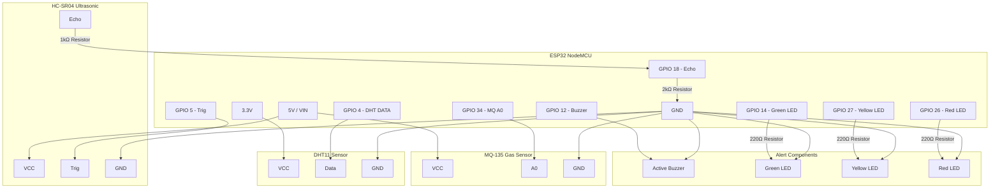

# Circuit Diagram & Wiring Reference

This document describes the electrical connections required to build the physical **Smart Waste Bin** using the ESP32 microcontroller.

---

## 1. Wiring Pin Mapping

| Component | Component Pin | ESP32 GPIO Pin | Connection Type / Description |
| :--- | :--- | :--- | :--- |
| **HC-SR04 Ultrasonic** | VCC | 5V / VIN | Power input (Requires 5V for optimal performance) |
| | GND | GND | Common ground reference |
| | TRIG | GPIO 5 | Output pin (triggers ultrasonic burst) |
| | ECHO | GPIO 18 | Input pin (voltage divider required: 5V → 3.3V) |
| **DHT11 (Temp/Hum)** | VCC | 3.3V | Power input |
| | GND | GND | Common ground reference |
| | DATA | GPIO 4 | Digital bidirectional data line (needs 10k pull-up) |
| **MQ-135 (Gas)** | VCC | 5V / VIN | Power input (heating element requires stable 5V) |
| | GND | GND | Common ground reference |
| | A0 (Analog) | GPIO 34 | Analog input (reads gas concentration voltage) |
| **Active Buzzer** | Positive (+) | GPIO 12 | Digital output (active HIGH triggers sound) |
| | Negative (-) | GND | Ground |
| **Status LEDs** | Green LED (Anode) | GPIO 14 | Empty status (through a 220Ω resistor) |
| | Yellow LED (Anode)| GPIO 27 | Half-Full status (through a 220Ω resistor) |
| | Red LED (Anode) | GPIO 26 | Full status (through a 220Ω resistor) |
| | Common Cathodes | GND | Common Ground |

---

## 2. Voltage Divider Circuit for Echo Pin

> [!WARNING]
> The ESP32 GPIO pins are **not 5V tolerant**. The HC-SR04 ultrasonic sensor runs on 5V and outputs a 5V logic signal on the Echo pin. Directly connecting the Echo pin to the ESP32 could damage the microcontroller. You MUST use a voltage divider to step down the signal to ~3.3V.

### Wiring Schematic (Voltage Divider):
```
HC-SR04 Echo Pin (5V)
       │
     [ 1 kΩ Resistor (R1) ]
       │
       ├─────── To ESP32 GPIO 18 (Reads ~3.3V)
       │
     [ 2 kΩ Resistor (R2) ]
       │
      GND
```

*Formula:*
$$V_{out} = V_{in} \times \left( \frac{R_2}{R_1 + R_2} \right) = 5\text{V} \times \left( \frac{2\text{k}\Omega}{1\text{k}\Omega + 2\text{k}\Omega} \right) \approx 3.33\text{V}$$

---

## 3. Full Schematic Diagram (Mermaid)


